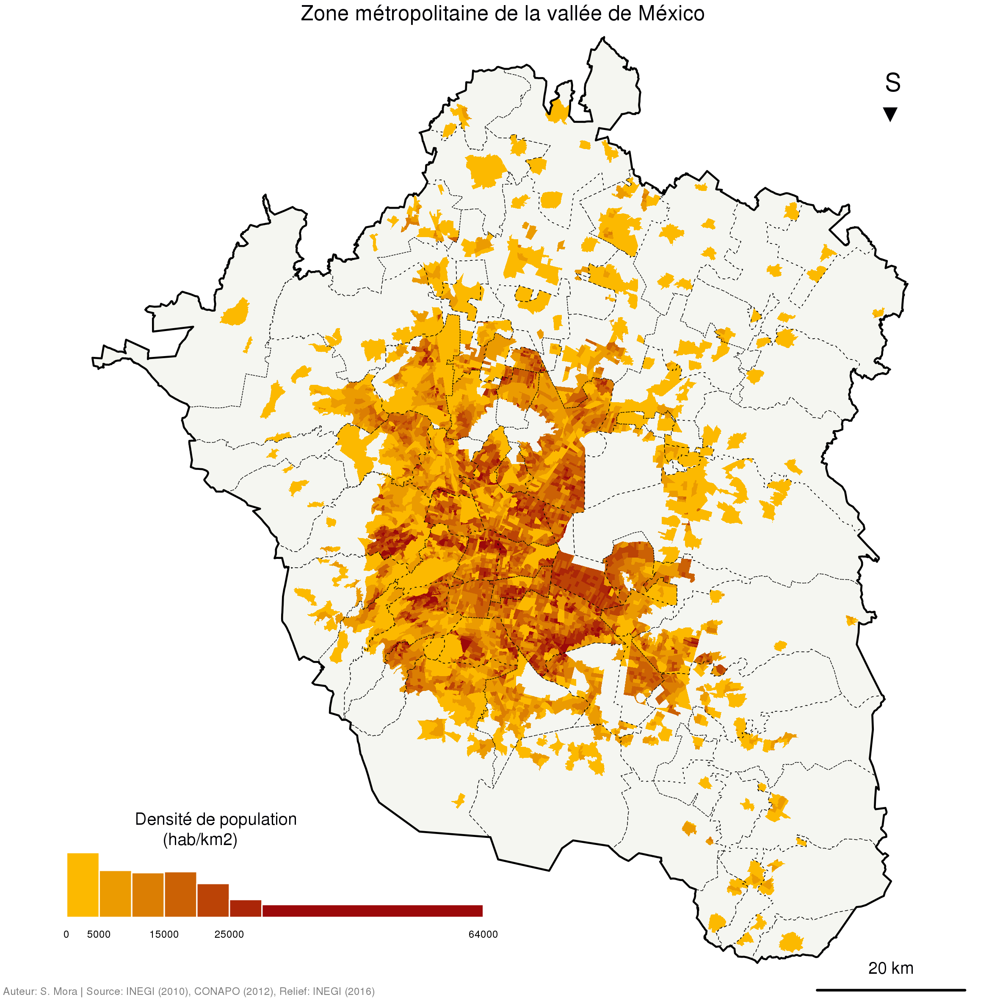
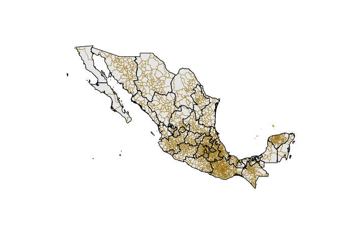
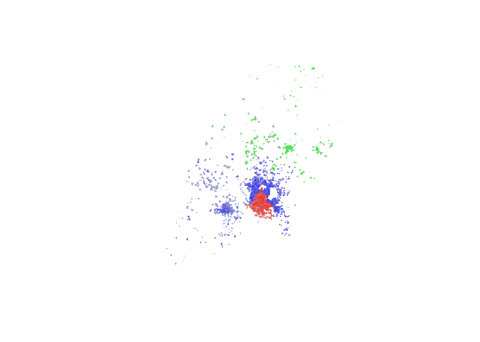
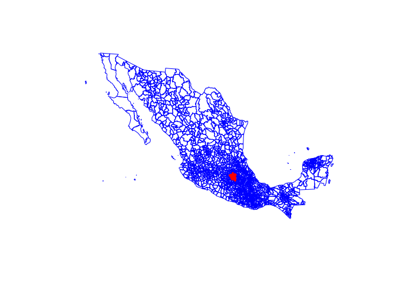
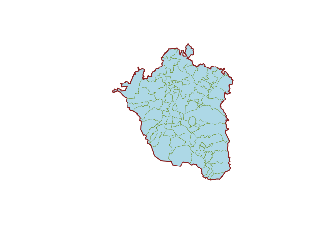
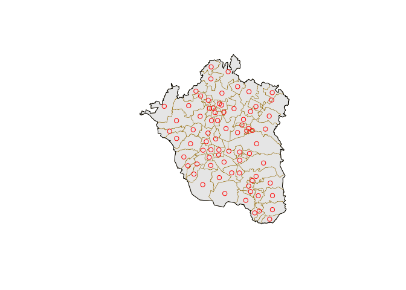
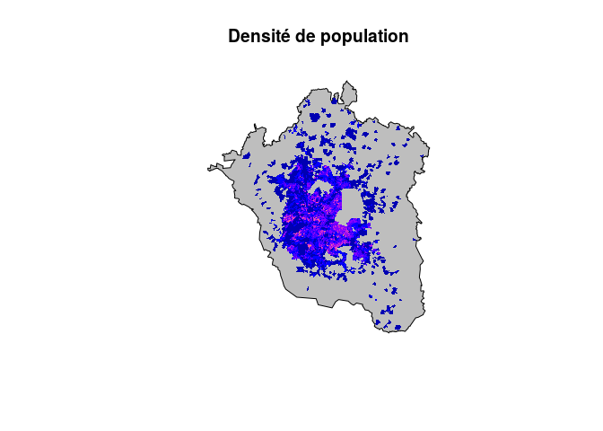

</br> </br>

**L’objectif de ce tutoriel est principalement d'introduire les utilisateurs de SIG à l'utilisation de R pour la construction de cartes thématiques. Tout en reconnaissant la grande diversité d’outils qui permettent les traitements et les représentation spatiales avec R, ce tutoriel s’appuie principalement sur l’utilisation du *package* [`sf`](https://github.com/edzer/sfr) récemment développé par Edzer Pebesma et successeur désigné des packages [`sp`](https://cran.r-project.org/web/packages/sp/index.html), [`rgeos`](https://cran.r-project.org/web/packages/rgeos/index.html) et [`rgdal`](https://cran.r-project.org/web/packages/rgdal/index.html).**

Une liste de resources portant sur l'utilisation du package `sf` est disponible à la fin de ce document.

------------------------------------------------------------------------



------------------------------------------------------------------------

La construction d’une **carte thématique** se déroule en plusieurs étapes comprenant la mises en forme, l'import, l'interprétation et la représentation des données. L’ensemble de cette chaîne mobilisait jusqu’à récemment un ensemble de logiciels de statistique, d’analyse spatiale et d’édition cartographique. Aujourd’hui, et concomitament à la disponibilité croissante de bases de données géoréférencés, les outils permettant les traitements cartographiques se diversifient. Les systèmes d’information géographique (SIG) intègrent des nouveaux d’outils et deviennent de plus en plus accessibles. R, s'il n'est pas a proprement parlé un SIG à part entière permet cependant d'effectuer toutes les opérations de la chaîne de traitement des données géographiques de la mise en forme à la représentation.

[R](https://www.r-project.org/) est un logiciel et un langage, dont la première version officielle fut publiéé en 2000, qui permet l’utilisation de plusieurs techniques d’analyse statistique. Dès le début ses créateurs s'appliquèrent à rendre possible la contribution des utilisateurs dans son développement. Il est construit dans un langage qui permet de créer des fonctions et de les ajouter au logiciel. Ainsi, au fil des années, les possibilités d’utilisation de R s’élargissent via les *packages* et le rendent polyvalent. C’est pour cette raison qu’il concurrence ou qu’il remplace toute une gamme de logiciels et de langages préexistants (Giraud & Lambert, 2017), non seulement sur plusieurs terrains d'analyse statistique, mais aussi dans le monde de la représentation graphique. En effet, R propose d’intéressantes sorties graphiques tout en laissant aux utilisateurs un contrôle complet.

Faire une carte de la Zone métropolitaine de la vallée de México
================================================================

L’objectif que nous nous donnons ici est de réaliser de réaliser de carte thématiques de la *Zone métropolitaine de la vallée de Mexico* (ZMVM). Nous utiliserons pour cela les Surfaces Géostatiques de Base (AGEB en espagnol), dont les géométries et les données associées sont distribuées par l’[Institut National de Géographie et Statistique du Mexique](http://www.inegi.org.mx/default.aspx) (INEGI en espagnol). La ZMVM est l’aire urbaine de la capitale du pays, formée par les 16 délégations de la Ville de Mexico et soixante municipalités voisines des États d'Hidalgo et de Mexico. Il s’agit d’une des agglomérations les plus peuplées du monde avec plus de 20 millions d’habitants.

Les données qui seront cartographiées portent sur la marginalité dans les zones urbaines et sont issues du [Conseil National de Population du Mexique](http://www.conapo.gob.mx/es/CONAPO/Descargas) (CONAPO en espagnol). La table, en format `CSV`, regroupe les diférents indices que la CONAPO utilise pour calculer l'indice de marginalité urbaine. En voici la description générale:

<table style="width:100%;">
<colgroup>
<col width="13%" />
<col width="86%" />
</colgroup>
<thead>
<tr class="header">
<th align="left">Champ</th>
<th align="left">Description</th>
</tr>
</thead>
<tbody>
<tr class="odd">
<td align="left">ID</td>
<td align="left">Identifiant</td>
</tr>
<tr class="even">
<td align="left">Ville</td>
<td align="left">Nom de la ville</td>
</tr>
<tr class="odd">
<td align="left">POP6_NScol</td>
<td align="left">Pourcentage de population de 6 à 14 ans qui ne va pas à l'école</td>
</tr>
<tr class="even">
<td align="left">POP15_NScol</td>
<td align="left">Pourcentage de population de plus de 15 ans qui n'a pas terminé le collège</td>
</tr>
<tr class="odd">
<td align="left">POP_SSPub</td>
<td align="left">Pourcentage de population sans accès à la santé publique</td>
</tr>
<tr class="even">
<td align="left">MortInf</td>
<td align="left">Pourcentage d'enfants morts de femmes entre 15 et 49 ans</td>
</tr>
<tr class="odd">
<td align="left">H_SEauC</td>
<td align="left">Pourcentage d'habitations sans eau courante</td>
</tr>
<tr class="even">
<td align="left">H_SCEg</td>
<td align="left">Pourcentage d'habitations sans conexion aux égoûts</td>
</tr>
<tr class="odd">
<td align="left">H_STCEg</td>
<td align="left">Pourcentage d'habitations sans toilettes connectées aux égoûts</td>
</tr>
<tr class="even">
<td align="left">H_Terre</td>
<td align="left">Pourcentage d'habitations avec un sol en terre</td>
</tr>
<tr class="odd">
<td align="left">H_Surp</td>
<td align="left">Pourcentage d'habitations surpeuplées</td>
</tr>
<tr class="even">
<td align="left">H_SRef</td>
<td align="left">Pourcentage d'habitations sans réfrigérateur</td>
</tr>
<tr class="odd">
<td align="left">IMU</td>
<td align="left">Indice de marginalité urbaine</td>
</tr>
</tbody>
</table>

Première partie : utiliser R comme un SIG
-----------------------------------------

### 1. Chargement des *packages*

R est composé d’un socle commun (`r-base`) sur lequel se greffe un ensemble de librairies ou *packages*. Il s'agit de fonctions implémentées par les utilisateurs et mises à disposition de tous par l’intermédiaire de dépôts regroupés dans le cadre du [Comprehensive R Archive Network](https://cran.r-project.org/) (CRAN).

``` r
# chargement (et installation s'il n'est pas déjà présent) du package
if(!require('sf')){
  install.packages('sf')
  library('sf')
}
```

    ## Loading required package: sf

    ## Linking to GEOS 3.5.1, GDAL 2.1.2, proj.4 4.9.2, lwgeom 2.3.2 r15302

### 2. Importer des données de type shapefile

La fonction `st_read` permet d'importer les shapefiles (et les autres formats SIG) dans R.

``` r
# Les états
MEX_est <- st_read(dsn = "data/shp", layer = "MEX_est")
```

    ## Reading layer `MEX_est' from data source `/home/tg/Documents/blg/intro_sf/data/shp' using driver `ESRI Shapefile'
    ## converted into: POLYGON
    ## Simple feature collection with 32 features and 2 fields
    ## geometry type:  MULTIPOLYGON
    ## dimension:      XY
    ## bbox:           xmin: -118.3665 ymin: 14.53496 xmax: -86.71074 ymax: 32.71873
    ## epsg (SRID):    4326
    ## proj4string:    +proj=longlat +datum=WGS84 +no_defs

``` r
# Les municipalités
MEX_mun <- st_read(dsn = "data/shp", layer = "MEX_mun", quiet = TRUE)

# Les 'AGEB' de la Ville de México, de l'Etat de México et  de l'Etat de Hidalgo
df_ageb <- st_read(dsn = "data/shp", layer = "distritoFederal_ageb", quiet = TRUE)
emex_ageb <- st_read(dsn = "data/shp", layer = "estadoMexico_ageb", quiet = TRUE)
hgo_ageb <- st_read(dsn = "data/shp", layer = "hidalgo_ageb", quiet = TRUE)
```

``` r
class(df_ageb) # Voir le type d'objet
```

    ## [1] "sf"         "data.frame"

**df\_ageb** est à la fois un objet `sf` et un objet `data.frame`. [Ce post](http://edzer.github.io/sfr/articles/sf1.html) explique clairement et en détail ce que sont les objets `sf`. Pour résumer, il s'agit de `data.frame` enrichis d'une colonne contenant des géométries (listes de coordonnées définissant des points, des lignes ou des surfaces).

Ces objets étant (aussi) des `data.frame`, nous pouvons les manipuler comme tels :

``` r
head(df_ageb, 5) # Voir les cinq premières lignes des données
```

    ## Simple feature collection with 5 features and 3 fields
    ## geometry type:  POLYGON
    ## dimension:      XY
    ## bbox:           xmin: 477883.8 ymin: 2156619 xmax: 479369.8 ymax: 2157841
    ## epsg (SRID):    32614
    ## proj4string:    +proj=utm +zone=14 +datum=WGS84 +units=m +no_defs
    ##              ID POPULATION ZMVM                       geometry
    ## 1 0900200010010       3424    1 POLYGON((478693.537847856 2...
    ## 2 0900200010025       5912    1 POLYGON((479369.658826806 2...
    ## 3 090020001003A       4638    1 POLYGON((478324.768970709 2...
    ## 4 0900200010044       5007    1 POLYGON((478459.061489113 2...
    ## 5 0900200010097       2260    1 POLYGON((478412.758866075 2...

``` r
summary(df_ageb$POPULATION) # Voir le résumé de l'information
```

    ##    Min. 1st Qu.  Median    Mean 3rd Qu.    Max. 
    ##       0    2014    3286    3623    4874   17152

Ils contiennent également des informations sur leur géométries :

``` r
st_crs(x = df_ageb) # Voir la projection de la couche
```

    ## $epsg
    ## [1] 32614
    ## 
    ## $proj4string
    ## [1] "+proj=utm +zone=14 +datum=WGS84 +units=m +no_defs"
    ## 
    ## attr(,"class")
    ## [1] "crs"

``` r
st_bbox(obj = df_ageb) # Voir la bounding box de la couche
```

    ##      xmin      ymin      xmax      ymax 
    ##  463960.4 2114567.6  505608.1 2166421.6

### 3. Affichage simple des couches

On montre ici le code le plus simple pour afficher les couches.

``` r
# Afficher les couches
plot(st_geometry(MEX_mun), # On demande l'affichage la géométrie de l'objet
     col = "grey90", # Couleur de remplissage des polygones
     border = "#916600", # Couleur de la ligne de bordure
     lwd = 0.5) # Largeur de la bordure

plot(st_geometry(MEX_est), 
     col = NA,
     border = "black",
     lwd = 1,
     add = TRUE) # Ajouter cette couche à celle précedement affichée
```



### 4. Opérations de géotraitement

Pour manipuler et mettre en forme nos couches géographiques `sf` permet la majorité des géotraitements SIG. Nous mettrons en place les traitements suivants :

-   reprojection
-   assemblage de couches
-   selection d'un sous-ensemble des données
-   agrégation
-   extraction des centroides

#### Reprojection

Plusieurs couches ne semble pas utiliser la même projection :

``` r
st_crs(x = hgo_ageb) == st_crs(x = MEX_est) 
```

    ## [1] FALSE

Nous prendrons comme référence la projection de la couche des AGEB de l'Hidalgo

``` r
# On peut définir la projection souhaitée
projMexique <- st_crs(x = hgo_ageb)

# Voici sa référence epsg
projMexique$epsg
```

    ## [1] 32614

``` r
# et sa définition proj4string
projMexique$proj4string
```

    ## [1] "+proj=utm +zone=14 +datum=WGS84 +units=m +no_defs"

La fonction `st_transform` permet de reprojeter les objets `sf`:

``` r
# Changer la projection des couches
MEX_est <- st_transform(x = MEX_est, crs = projMexique)
MEX_mun <- st_transform(x = MEX_mun, crs = projMexique)
```

#### Assembler plusieures couches

La fonction `rbind` peut être utiliser pour assembler plusieurs couches.

``` r
# Joindre plusieurs couches
ageb <- rbind(df_ageb, emex_ageb, hgo_ageb)

# affichage de l'assemblage
plot(st_geometry(ageb), col = "grey", border = NA)
# puis les couches constitutives
plot(st_geometry(df_ageb), col = NA, border = "red", lwd = 0.1, add=T)
plot(st_geometry(emex_ageb), col = NA, border = "blue", lwd = 0.1, add=T)
plot(st_geometry(hgo_ageb), col = NA, border = "green", lwd = 0.1, add=T)
```



#### Selectionner des entités

Ici nous extrayons les entités faisant partie de la Zone Métropolitaine de Mexico. Ces entités sont identifiée par la valeur 1 dans le champs ZMVM.

``` r
# Créer un sous-ensemble de nos couches
ZMVM_mun <- MEX_mun[MEX_mun$ZMVM == 1,]
ZMVM_ageb <- ageb[ageb$ZMVM == 1,]

# affichage de toutes les municipalités
plot(st_geometry(MEX_mun), col=NA, border = "blue")
# affichage des municipalités de la ZMVM
plot(st_geometry(ZMVM_mun), col = "red", border = NA, add = T)
```



#### Agéger des polygones

``` r
# Agréger les polygones
ZMVM <- st_union(ZMVM_mun)

class(ZMVM) # Cette opération créé un objet sfc
```

    ## [1] "sfc_POLYGON" "sfc"

``` r
ZMVM <- st_sf(id = 1, geometry=ZMVM) # Que l'on peut retransformer en objet sf

# affichage de la couche des municipalités de la ZMVM
plot(st_geometry(ZMVM_mun), col = "lightblue", border = "olivedrab", lwd = 0.5)
# affichage de la couche de la ZMVM
plot(st_geometry(ZMVM), col = NA, border = 'brown4', lwd = 2, add=T)
```



#### Extraire des centroides

``` r
# Extraire les centroides des polygones
ZMVM_munC <- st_centroid(ZMVM_mun)

# Afficher les couches
plot(st_geometry(ZMVM_mun), 
     col = "grey90",
     border = "#916600",
     lwd = 0.5)

plot(st_geometry(ZMVM), 
     col = NA,
     border = "black",
     lwd = 1,
     add = T)

plot(st_geometry(ZMVM_munC), 
     col = "red",
     add = T)
```



### 5. Gestion des bases de données

R est surtout spécialisé dans l'analyse statistique de bases de données. L'intérêt des `Simple Features` est d'être facilement compatible avec les principaux objets et formats R (vecteurs, matrices, tables).

``` r
#Importer les données en format csv
marginalite <- read.csv("data/csv/marginaliteZMVM.csv")

head(marginalite)
```

    ##              ID          Ville POP6_NScol POP15_NScol POP_SSPub  MortInf
    ## 1 0100100010229 Aguascalientes   3.448276    35.01805  30.48780 5.050505
    ## 2 0100100010233 Aguascalientes   7.142857    36.32120  26.85003 3.863299
    ## 3 0100100010286 Aguascalientes   1.776650    17.46200  27.10145 1.508621
    ## 4 0100100010290 Aguascalientes   1.769912    19.61564  31.30765 1.353638
    ## 5 0100100010303 Aguascalientes   3.779070    31.61012  30.38721 2.325581
    ## 6 0100100010322 Aguascalientes   4.918033    31.94222  30.27211 2.930403
    ##     H_SEauC    H_SCEg    H_STCEg   H_Terre    H_Surp    H_SRef        IMU
    ## 1 0.0000000 0.0000000 20.1923077 2.8846154 20.192308 9.6153846 -0.4734906
    ## 2 1.4251781 0.9501188 16.3895487 1.6666667 19.239905 8.8305489 -0.4804672
    ## 3 0.5096840 0.0000000  1.0214505 2.6476578  5.482234 1.0162602 -1.1644005
    ## 4 0.1988072 0.1984127  0.7936508 0.1984127  7.768924 0.5952381 -1.1466875
    ## 5 0.6410256 0.1612903  6.4516129 0.1600000 14.240000 2.8846154 -0.8434950
    ## 6 0.9771987 0.1631321 11.9086460 1.1437908 16.775244 4.8859935 -0.6966987

``` r
# La jointure se fait comme pour deux data frames classiques:
ZMVM_ageb <- merge(ZMVM_ageb, marginalite, by = "ID", all.x = TRUE)

head(ZMVM_ageb)
```

    ## Simple feature collection with 6 features and 15 fields
    ## geometry type:  POLYGON
    ## dimension:      XY
    ## bbox:           xmin: 477883.8 ymin: 2156619 xmax: 479369.8 ymax: 2157841
    ## epsg (SRID):    32614
    ## proj4string:    +proj=utm +zone=14 +datum=WGS84 +units=m +no_defs
    ##              ID POPULATION ZMVM           Ville POP6_NScol POP15_NScol
    ## 1 0900200010010       3424    1 Valle de México  0.5509642    27.08333
    ## 2 0900200010025       5912    1 Valle de México  1.9230769    31.21795
    ## 3 090020001003A       4638    1 Valle de México  2.9250457    32.72324
    ## 4 0900200010044       5007    1 Valle de México  2.4604569    29.75058
    ## 5 0900200010097       2260    1 Valle de México  3.5555556    29.56284
    ## 6 090020001010A       3385    1 Valle de México  2.0289855    26.56309
    ##   POP_SSPub  MortInf    H_SEauC     H_SCEg   H_STCEg   H_Terre   H_Surp
    ## 1  23.23324 2.590090 0.24691358 0.12345679 0.3708282 0.6234414 14.69136
    ## 2  18.22719 2.544667 0.00000000 0.00000000 1.0276172 0.0000000 21.97309
    ## 3  19.73477 2.401747 0.08920607 0.08920607 0.6283662 0.0000000 23.43470
    ## 4  22.02008 1.983003 0.07898894 0.00000000 0.3955696 0.1593625 18.37539
    ## 5  20.33591 2.010969 0.00000000 0.00000000 0.1798561 0.3603604 12.00717
    ## 6  23.47388 1.785714 0.00000000 0.00000000 0.1262626 0.1264223 10.08827
    ##      H_SRef        IMU                       geometry
    ## 1 0.7407407 -1.0478255 POLYGON((478693.537847856 2...
    ## 2 2.6888604 -0.9378904 POLYGON((479369.658826806 2...
    ## 3 1.1617516 -0.8975354 POLYGON((478324.768970709 2...
    ## 4 1.8957346 -0.9761590 POLYGON((478459.061489113 2...
    ## 5 0.8976661 -1.0198169 POLYGON((478412.758866075 2...
    ## 6 1.0088272 -1.0956621 POLYGON((478677.599387444 2...

``` r
#Créer une colonne avec la surface des polygones
ZMVM_ageb$Superficie <- st_area(ZMVM_ageb)

class(ZMVM_ageb$Superficie)
```

    ## [1] "units"

``` r
# Les unité sont définies par la projection. Ici on est en mètres carrés, il
# faut donc les transformer en kilomètres carrés grace au package units
library(units)
units(ZMVM_ageb$Superficie) <- with(ud_units, km^2)

# Créer une colonne avec la densité de population
ZMVM_ageb$DensPop <- ZMVM_ageb$POPULATION/ZMVM_ageb$Superficie

# Carte basique de la densité de population
plot(st_geometry(ZMVM), col = "grey")
plot(ZMVM_ageb['DensPop'], border = NA, add=T)
title("Densité de population")
```



### 6. Exporter les objets sf

Il est finalement possible d'exporter les objets `sf` au format `shapefile` pour les utiliser dans un SIG ou au format(s) natif(s) de R, `RDS` par exemple.

``` r
# Export au format shapefile
write_sf(obj = ZMVM, dsn = "data/shp/ZMVM.shp")
write_sf(obj = ZMVM_ageb, dsn = "data/shp/ZMVM_ageb.shp")
write_sf(obj = ZMVM_mun, dsn = "data/shp/ZMVM_mun.shp")
write_sf(obj = ZMVM_munC, dsn = "data/shp/ZMVM_munC.shp")

# Export au format rds (utilisés dans les didactiels suivants)
saveRDS(object = MEX_est, file = "data/rds/MEX_est.rds")
saveRDS(object = MEX_mun, file = "data/rds/MEX_mun.rds")
saveRDS(object = ZMVM, file = "data/rds/ZMVM.rds")
saveRDS(object = ZMVM_ageb, file = "data/rds/ZMVM_ageb.rds")
saveRDS(object = ZMVM_mun, file = "data/rds/ZMVM_mun.rds")
saveRDS(object = ZMVM_munC, file = "data/rds/ZMVM_munC.rds")
```

Fin de la première partie du tutorat. Continuer avec la [deuxième partie](lelien2.com).
