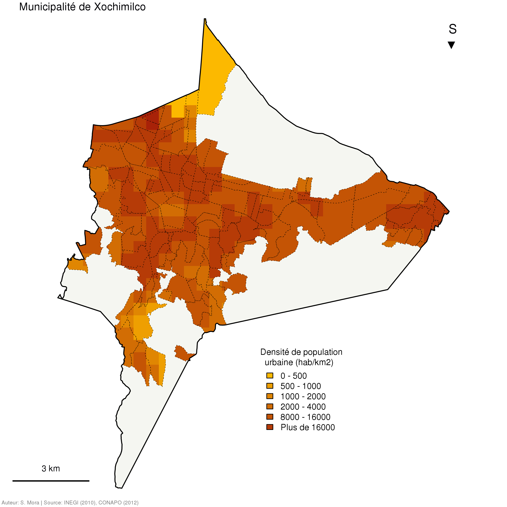

# Faire une carte en carroyage


</br>
</br>


**Cette partie est destinée a la création d’une carte ou le maillage initial est transformé en maillage régulier. Ce type de transformation est particulièrement utile quand la comparaisons de cartes est rendue difficile à cause maillage très différents ou très hétérogènes. Nous allons créer un maillage régulier sur l'une des municipalités de la *Zone métropolitaine de la vallée de México* et y transférer les données des AGEB pour produire une carte de densité.** 


---

  

---


## Charger les libraires

```{r, cache = TRUE}
library(sf)
```


## Importer les données 

Nous importons les données créées dans [le premier tutoriel](./intro_sf.md). 

```{r, cache = TRUE}
MEX_mun <- readRDS(file = "data/rds/MEX_mun.rds")
ZMVM_ageb <- readRDS(file = "data/rds/ZMVM_ageb.rds")
ZMVM_mun <- readRDS(file = "data/rds/ZMVM_mun.rds")
```


## Traitement des couches

Nous réalisons tout d'abord un traitment d'extraction de données pour se concentrer sur l'une des municipalités de la *ZMVM* : Xochimilco.

```{r , cache = TRUE}
# Extraire la municipalité de Xochimilco
XOCH <- subset(ZMVM_mun, ZMVM_mun$ID == c("09013"))

# Extraire les AGEB de Xochimilco
XOCH_ageb <- ZMVM_ageb[substr(x = ZMVM_ageb$ID, 1, 5) == "09013",]

# Créer une couche avec le contour des zones urbanisées
XOCH_agebU <- st_union(XOCH_ageb)

XOCH_agebU <- st_sf(id = 1, geometry = XOCH_agebU) # Passer de sfc a sf
```


## Faire une grille de densités


La fonction `st_makegrid` permet de créer un maillage régulier sur l'étendue d'un objet `sf`. 
La fonction `st_interpolate_aw`permet d'interpoler les données du maillage initial dans la grille.

```{r , cache = TRUE}
# Créer le maillage régulier (taille des cellules : 500 mètres de côté)
cadrillage <- st_make_grid(XOCH, cellsize = 500)

# On affiche la grille
plot(st_geometry(XOCH))
plot(st_geometry(XOCH_agebU), add=T, col = "red", lwd = 0.2)
plot(cadrillage, border = "grey70", add = T)

# Faire l'intersection et les zones urbaines
cadrillage <- st_intersection(XOCH_agebU, cadrillage)

# On affiche la grille
plot(st_geometry(XOCH))
plot(cadrillage, col = "grey90", border = "grey70", add = T)

# Interpolation des valeurs
cadrillage_POP <- st_interpolate_aw(x = XOCH_ageb["POPULATION"],
                                    to = cadrillage, 
                                    extensive = TRUE)

# Calculer la densité de population
cadrillage_POP$densite <- cadrillage_POP$POPULATION * 1000000 / st_area(cadrillage_POP)
```


## Faire la carte


```{r , cache = TRUE}
# Voir la répartition de nos données
hist(cadrillage_POP$densite)
summary(cadrillage_POP$densite)

# Faire palette de couleurs
couleurs <- colorRampPalette(c("#FCB900","#9B090A"), interpolate = "linear")(8)

# Faire les intervalles de discrétisation
classes <- c(0,500,1000,2000,4000,8000,16000,32000)

# Choisir les paramètres de la fenêtre d'affichage
par(mar = c(0,0,0,0), fig = c(0,1,0,1))

plot(st_geometry(XOCH),
     col = "#F5F6F1",
     border = NA)

plot(st_geometry(cadrillage_POP), 
     col = couleurs[findInterval(cadrillage_POP$densite, vec = classes, all.inside = TRUE)],
     border = NA,
     add = T)


# Afficher les couches d'habillage
plot(st_geometry(XOCH_ageb),
     col= NA,
     border = "Black", lwd = 0.5, lty = 3,
     add = T)

plot(st_geometry(XOCH),
     col = NA,
     border = "Black", lwd = 1.5,
     add = T)


# Ajouter un titre 
mtext(text = "Municipalité de Xochimilco", 
      side = 3, line = -1, adj = 0.05, cex = 1, col = "#000004FF")

# Ajouter une légende : 

xleg <- grconvertX(c(0.50), from = "ndc", to = "user")
yleg <- grconvertY(c(0.30), from = "ndc", to = "user")

classes_leg <- c("0 - 500","500 - 1000","1000 - 2000","2000 - 4000","8000 - 16000","Plus de 16000")

legend(x = xleg, y = yleg,title = "  Densité de population\nurbaine (hab/km2)",
       legend = classes_leg,
       fill = couleurs, box.col = NA,
       cex = 0.8)

# Ajouter une flèche du nord (ou plutôt du sud!)
mtext(text = "S\n▼", 
      side = 3, line = -4, adj = 0.9, cex = 1.2, col = "#000004FF")

# Ajouter une échelle
segments(x0 = 482000, y0 = 2118000, x1 = 485000, y1 = 2118000,
         col = "Black",
         lwd = 2)

text(x = 483500, y = 2118500,
     labels = "3 km",
     cex = 0.8, col = "#000004FF")

# Ajouter les réferences et sources
mtext(text = " Auteur: S. Mora | Source: INEGI (2010), CONAPO (2012) ",
      side = 1, line = -1, adj = 0, cex = 0.5, col = "grey50")
```


## Comparer les maillages aux unités géostatisques

On peut comparer la carte de densités en maille avec celle des densités par unité géostatistique. On verra que chaque carte offre des possibilités d'interprétation différentes. À  vous de juger!

```{r , cache = TRUE}
par(mfrow=c(1,2), mar = rep(0,4))

# Première carte
plot(st_geometry(XOCH),
     col = "#F5F6F1",
     border = NA)

plot(st_geometry(cadrillage_POP), 
     col = couleurs[findInterval(cadrillage_POP$densite, vec = classes, all.inside = TRUE)],
     border = NA,
     add = T)

plot(st_geometry(XOCH),
     col = NA,
     border = "Black", lwd = 1.5,
     add = T)

mtext(text = "Maillage", 
      side = 3, line = -1, adj = 0.05, cex = 1, col = "#000004FF")

mtext(text = " Auteur: S. Mora | Source: INEGI (2010), CONAPO (2012) ",
      side = 1, line = -1, adj = 0, cex = 0.5, col = "grey50")

xleg <- grconvertX(c(0.26), from = "ndc", to = "user")
yleg <- grconvertY(c(0.35), from = "ndc", to = "user")

classes_leg <- c("0 - 500","500 - 1000","1000 - 2000","2000 - 4000","8000 - 16000","Plus de 16000")

legend(x = xleg, y = yleg,title = "  Densité de population\nurbaine (hab/km2)",
       legend = classes_leg,
       fill = couleurs, box.col = NA,
       cex = 0.8)

# Deuxième carte
plot(st_geometry(XOCH),
     col = "#F5F6F1",
     border = NA)

plot(st_geometry(XOCH_ageb), 
     col = couleurs[findInterval(XOCH_ageb$Densite, vec = classes, all.inside = TRUE)],
     border = NA, lwd = 0.5, lty = 3,
     add = T)

plot(st_geometry(XOCH),
     col = NA,
     border = "Black", lwd = 1.5,
     add = T)

mtext(text = "Unités géostatistiques", 
      side = 3, line = -1, adj = 0.05, cex = 1, col = "#000004FF")

mtext(text = "S\n▼", 
      side = 3, line = -4, adj = 0.9, cex = 1.2, col = "#000004FF")

segments(x0 = 492000, y0 = 2118000, x1 = 495000, y1 = 2118000,
         col = "Black",
         lwd = 2)

text(x = 493500, y = 2118500,
     labels = "3 km",
     cex = 0.8, col = "#000004FF")
```


[1. Introduction générale au package `sf`](./intro_sf.md)  
[2. Faire une carte en figurés proportionnels](./propsymb.md)  
[3. Faire une carte choroplèthe](./choro.md)  
[4. Faire une carte en carroyage](./carro.md)  
[5. Liste de ressources sur le package `sf`](./links.md)  
</br>
</br>
[](http://riate.cnrs.fr)