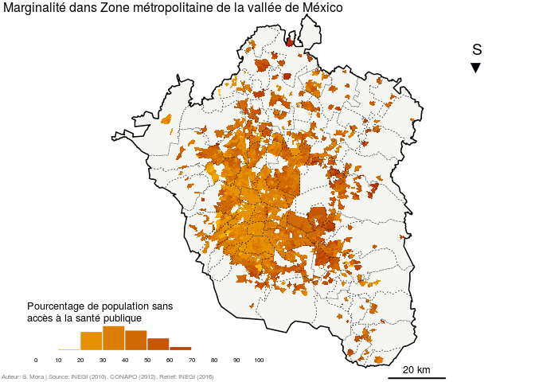
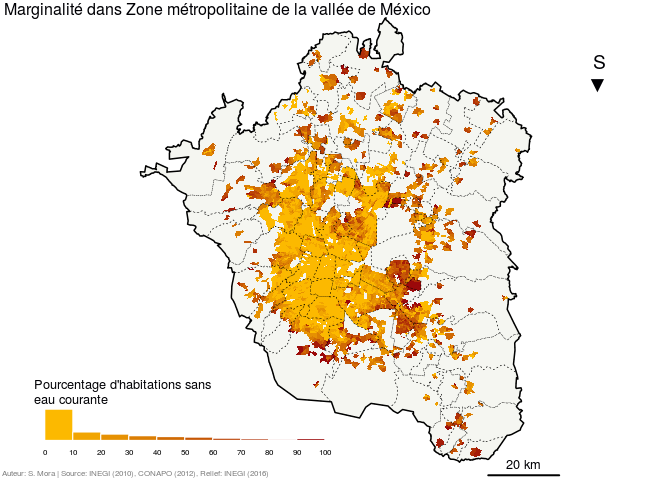
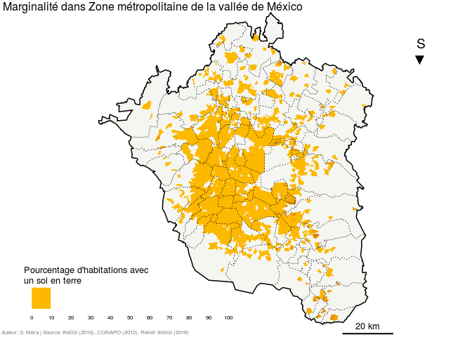
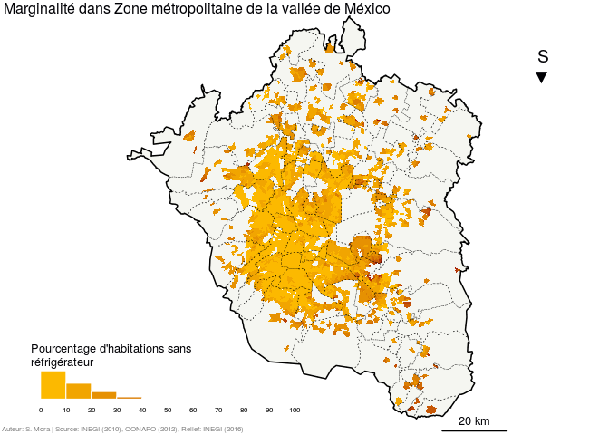

Faire une carte chorplèthe
==========================

</br> </br>

**Cette partie a pour objectif la construction d’une carte de ratios. Pour faire une carte choroplèthe il faudra créer des palettes de couleurs et choisir une discrétisation des valeurs qui soit statistiquement et visuellement intéressante. La dernière partoe explique comment créer une série de cartes.**

------------------------------------------------------------------------


------------------------------------------------------------------------

Charger les libraires
---------------------

Ce tutoriel repose entièrement sur l'usage du *package* `sf`.

``` r
library(sf)
```

    ## Linking to GEOS 3.5.1, GDAL 2.1.2, proj.4 4.9.2, lwgeom 2.3.2 r15302

Importer les données
--------------------

Nous importons les données créées dans [le premier tutoriel](./intro_sf.md).

``` r
MEX_est <- readRDS(file = "data/rds/MEX_est.rds")
MEX_mun <- readRDS(file = "data/rds/MEX_mun.rds")
ZMVM <- readRDS(file = "data/rds/ZMVM.rds")
ZMVM_ageb <- readRDS(file = "data/rds/ZMVM_ageb.rds")
ZMVM_mun <- readRDS(file = "data/rds/ZMVM_mun.rds")
ZMVM_munC <- readRDS(file = "data/rds/ZMVM_munC.rds")
```

Paramétrage des couleurs
------------------------

En cartographie, la couleur est une variable immédiatement et intensément perceptible, ce qui lui donne un fort pouvoir différentiel. Son emploi est très apprécié tant par le lecteur que par le cartographe, elle permet d’innombrables possibilités de variations visuelles et favorise l’esthétisme (Nicolas Lambert, [Carnet NÉOCARTOgraphique](http://neocarto.hypotheses.org/1458)). On verra donc une méthode simple pour créer une palette de couleurs adaptée à nos besoins cartographiques.

``` r
# Voir la distribution des données
summary(ZMVM_ageb$IMU)
```

    ##    Min. 1st Qu.  Median    Mean 3rd Qu.    Max.    NA's 
    ## -1.6123 -0.9114 -0.4156 -0.2939  0.1665  3.0280     245

``` r
hist(ZMVM_ageb$IMU)
```


``` r
# En fonction de la distribution de nos données on peut choisir les
# intervalles de notre discrétisation
classes <- c(-2,-1,0,1,2,3,4) # Donc 6 classes

# Création d'une palette de couleurs discrétisée sur 7 classes
# On commence par la palette des valeurs négatives de l'indice
couleursN <- colorRampPalette(c("#677759", # première couleur de la palette
                                "#FCB900"), # dernière couleur
                             interpolate = "linear")(3)

couleursN <- couleursN[1:2] # On efface la troisième valeur (#FCB900) pour 
#                             qu'elle ne se répéte pas

# On continue avec la partie positive
couleursP <- colorRampPalette(c("#FCB900","#9B090A"), interpolate = "linear")(4)

# Et enfin on regroupe les deux palettes pour n'en faire qu'une seule
couleurs <- c(couleursN,couleursP)

couleurs
```

    ## [1] "#677759" "#B1982C" "#FCB900" "#DB7E03" "#BB4306" "#9B090A"

``` r
# Afficher la palette de couleurs
image(1:6, 1, as.matrix(1:6),
      col = couleurs, 
      xlab = "", ylab = "", 
      xaxt = "n", yaxt = "n", 
      bty = "n")
```


### 4. Faire la carte

R offre plusieurs options graphiques pour la conception de carte. La partie suivante, montre donc touts les choix qu’on été fait dans la contruction de la carte d'Indice de Marginalité Urbaine. Il suffit de changer quelques paramètres pour réussir a avoir son propre style cartographique.

``` r
# Choisir les paramètres de la fenêtre d'affichage
opar <- par(mar = c(0,0,0,0), fig = c(0,1,0,1))

# Afficher le fond de carte
plot(st_geometry(ZMVM),
     col = "#F5F6F1",
     border = NA)

# Afficher la couche choroplète, ici on fait appel à la fonction 'findInterval' pour que
# les couleurs soient associées aux classes que l'on a définit précédement.
plot(st_geometry(ZMVM_ageb),
     col = couleurs[findInterval(ZMVM_ageb$IMU, vec = classes, all.inside = TRUE)],
     border = NA,
     add = T)

# Afficher les couches d'habillage
plot(st_geometry(ZMVM_mun),
     col= NA,
     border = "Black",
     lwd = 0.5, lty = 3, # paramétrage des contours
     add = T)

plot(st_geometry(ZMVM),
     col = NA,
     border = "Black", lwd = 1.5,
     add = T)


# Ajouter un titre 
mtext(text = " Zone métropolitaine de la vallée de México", 
      side = 3, line = -1, adj = 0.5, cex = 1, col = "#000004FF")

# Ajouter une flèche du nord (ou plutôt du sud!)
mtext(text = "S\n▼", 
      side = 3, line = -5, adj = 0.9, cex = 1.2, col = "#000004FF")

# Ajouter une échelle
segments(x0 = 530000, y0 = 2090000, x1 = 550000, y1 = 2090000,
         col = "Black",
         lwd = 2)

text(x = 540000, y = 2093000,
     labels = "20 km",
     cex = 0.8, col = "#000004FF")

# Ajouter les réferences et sources
mtext(text = " Auteur: S. Mora | Source: INEGI (2010), CONAPO (2012), Relief: INEGI (2016) ",
      side = 1, line = -1, adj = 0, cex = 0.5, col = "grey50")

# Ajouter une légende : 
# Choisir les paramètres de la fenêtre d'affichage
par(fig = c(0.05,0.5,0.08,0.3),
    mar = c(0,0,0,0),
    new = TRUE)

# Afficher l'histogramme qui sera utlisé comme légende
hist(ZMVM_ageb$IMU, breaks = classes, freq = FALSE,
     col = couleurs, axes = F, xlab = "", ylab = "",
     main = "", border = "White")

axis(side = 1, at = classes, labels = classes,
     cex.axis = 0.5, tick = FALSE, line = -1.1, col.axis = "Black")

# Ajouter une titre à la légende
mtext(text = "Indice de marginalité urbaine", 
      side = 3, line = 0, adj = 0, cex = 0.8, col = "#000004FF")
```


``` r
#réinitialiser la fenêtre graphique
par(opar)
```

### 5. Faire plusieurs cartes d'un coup

L'utilisation de boucles permet d'automatiser certaines tâches répétitives. Nous produisons ici 10 cartes en utilisant à chaque fois un champ différent de la table d’attributs. Les distribution statistiques des indicateurs sont très variées et nécessiterait d'être étudiées individuelement. Il s'agit donc uniquement d'un premier jet exploratoire.

``` r
# Créer une palette de couleurs
couleurs1 <- colorRampPalette(c("#FCB900","#9B090A"), interpolate = "linear")(10)


# Définir les intervalles de classification
# Ici tous les indice utilisés sont des pourcentages, on choisit donc une
# discrétisation 'neutre'
classes1 <- c(0,10,20,30,40,50,60,70,80,90,100)

# On crée notre jeux de legendes
leg1 <- c("Pourcentage de population de 6 à 14 ans\nqui ne va pas à l'école")
leg2 <- c("Pourcentage de population de plus de\n15 ans qui n'a pas terminé le collège")
leg3 <- c("Pourcentage de population sans\naccès à la santé publique")
leg4 <- c("Pourcentage d'enfants morts de\nfemmes entre 15 et 49 ans")
leg5 <- c("Pourcentage d'habitations sans\neau courante")
leg6 <- c("Pourcentage d'habitations sans\nconexion aux égoûts")
leg7 <- c("Pourcentage d'habitations sans\ntoilettes connectées aux égoûts")
leg8 <- c("Pourcentage d'habitations avec\nun sol en terre")
leg9 <- c("Pourcentage d'habitations\nsurpeuplées")
leg10 <- c("Pourcentage d'habitations sans\nréfrigérateur")

# Et on les sauvegarde dans une liste
leg <- list(leg1,leg2,leg3,leg4,leg5,leg6,leg7,leg8,leg9,leg10)

# On fait une vecteur avec le nom des variables que l'on veut représenter
indices <- paste0("Indice", seq(1,10,1))

#Afficher les couches de cartes
for (i in 1:10){
  par(mar=c(0,0,0,0), fig = c(0,1,0,1))

  plot(st_geometry(ZMVM),
       col= "#F5F6F1",
       border=NA)
  plot(st_geometry(ZMVM_ageb),
       col = couleurs1[findInterval(ZMVM_ageb[[indices[i]]], 
                                   vec = classes1, all.inside=TRUE)],
       border= NA,
       add = T)
  plot(st_geometry(ZMVM_mun),
       col= NA,
       border = "Black", lwd = 0.5, lty = 3,
       add = T)
  plot(st_geometry(ZMVM),
       col= NA,
       border="Black", lwd = 1.5,
       add=T)
  
  mtext(text = " Marginalité dans Zone Métropolitaine du Valle de México", 
        side = 3, line = -1, adj = 0, cex = 1, col = "#000004FF")
  
  mtext(text = "S\n▼", 
      side = 3, line = -5, adj = 0.9, cex = 1.2, col = "#000004FF")
  
  segments(x0 = 530000, y0 = 2090000, x1 = 550000, y1 = 2090000,
         col = "Black",
         lwd = 2)
  text(x = 540000, y = 2093000,
     labels = "20 km",
     cex = 0.8, col = "#000004FF")
  
  mtext(text = " Auteur: S. Mora | Source: INEGI (2010), CONAPO (2012), Relief: INEGI (2016) ",
      side = 1, line = -1, adj = 0, cex = 0.5, col = "grey50")
  
  #Légende
  par(fig = c(0.05,0.5,0.08,0.15),
    mar = c(0,0,0,0),
    new = TRUE)
  
  hist(ZMVM_ageb[[indices[i]]], breaks = classes1, freq = FALSE,
       col = couleurs1, axes = F, xlab = "", ylab = "",
       main = "", border = "White")
  
  axis(side = 1, at = classes1, labels = classes1,
     cex.axis = 0.5, tick = FALSE, line = -1.1, col.axis = "Black")
  
  mtext(text = paste0(leg[i]), 
        side = 3, line = 0, adj = 0, cex = 0.8, col = "#000004FF")
}
```


