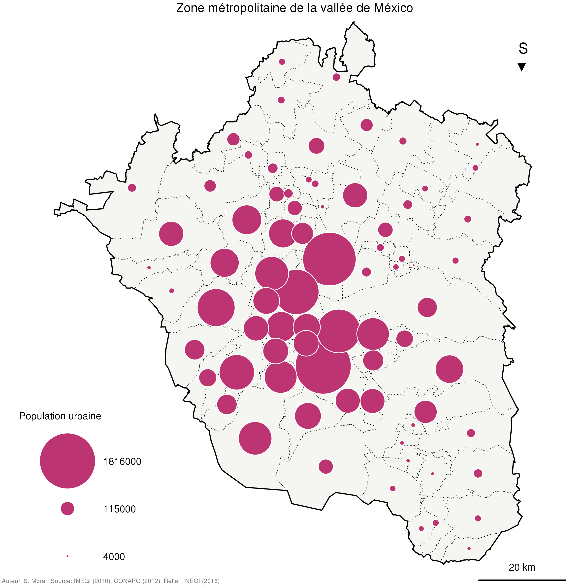
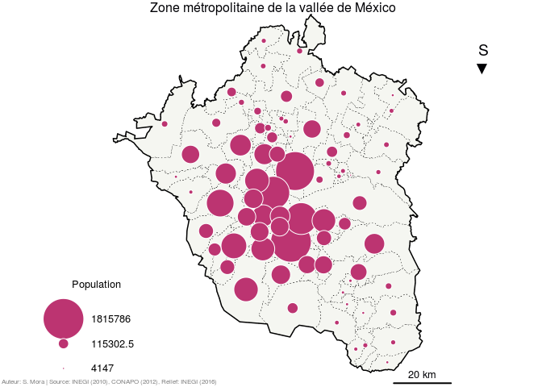

Faire une carte en figurés proportionnels
=========================================

</br> </br>

**L’objectif de ce tutoriel est de réaliser une carte en symboles proportionnels.**

------------------------------------------------------------------------



------------------------------------------------------------------------

Charger les libraires
---------------------

Ce tutoriel repose entièrement sur l'usage du *package* `sf`.

``` r
library(sf)
```

    ## Linking to GEOS 3.5.1, GDAL 2.1.2, proj.4 4.9.2, lwgeom 2.3.2 r15302

Importer des données
--------------------

Nous importons les données créées dans [le premier tutoriel](./intro_sf.md).

``` r
MEX_est <- readRDS(file = "data/rds/MEX_est.rds")
MEX_mun <- readRDS(file = "data/rds/MEX_mun.rds")
ZMVM <- readRDS(file = "data/rds/ZMVM.rds")
ZMVM_ageb <- readRDS(file = "data/rds/ZMVM_ageb.rds")
ZMVM_mun <- readRDS(file = "data/rds/ZMVM_mun.rds")
ZMVM_munC <- readRDS(file = "data/rds/ZMVM_munC.rds")
```

Paramétrage des cercles
-----------------------

Le *package* `sf` permet d'afficher des symboles et de faire varier leur taille en fonctions des valeurs d'un des champs de la base de données. Cependant, quand il s'agit de cercles, il est sémiologiquement incorrect d'établir une relation directe entre les valeurs absolues et le diamètre (ou le rayon) des symboles. Il faut plutôt utiliser la surface des symboles. Pour établir une relation entre les valeurs de la variable et la **surface** des cercles nous pouvons utiliser la fonction suivante :

``` r
# Fonction pour aboutir a une taille de cercles correcte
# Cette fonction permet aussi d'établir une valeur de référence pour contrôler la taille des cercles
taille <- function(x, ref, cex){
  t <- sqrt(x)
  c <- sqrt(ref)
  r <- cex * t / c
  return(r)
}
# "ref" sera la valeur de référence que l'on veut associer à une taille "cex".
```

Faire la carte
--------------

``` r
# Choisir les paramètres de la fenêtre d'affichage
opar <- par(mar = c(0,0,0,0), fig = c(0,1,0,1))


# Afficher le fond de carte
plot(st_geometry(ZMVM_mun),
     col = "#F5F6F1",
     border = "black", lty = 3, lwd = 0.5)

# Afficher les symboles proportionnels
# Il faut d'abord les trier de manière à ce que les plus gros cercles ne 
# recouvrent pas les plus petits
ZMVM_munC <- ZMVM_munC[order(ZMVM_munC$POPULATION, decreasing = T),]

plot(st_geometry(ZMVM_munC),
     pch = 21,  
     cex = taille(x = ZMVM_munC$POPULATION, 
                  ref = max(ZMVM_munC$POPULATION), 
                  cex = 7),
     col = "White", bg = "#BC3471",
     add = T)


# Afficher les limites ed la ZMVM
plot(st_geometry(ZMVM),
     col = NA,
     border = "Black", lwd = 1.5,
     add = T)

# Ajouter un titre 
mtext(text = " Zone métropolitaine de la vallée de México", 
      side = 3, line = -1, adj = 0.5, cex = 1, col = "#000004FF")

# Ajouter une flèche du nord (ou plutôt du sud!)
mtext(text = "S\n▼", 
      side = 3, line = -5, adj = 0.9, cex = 1.2, col = "#000004FF")

# Ajouter une échelle
segments(x0 = 530000, y0 = 2090000, x1 = 550000, y1 = 2090000,
         col = "Black",
         lwd = 2)

text(x = 540000, y = 2093000,
     labels = "20 km",
     cex = 0.8, col = "#000004FF")

# Ajouter une légende
# Tout d'abord on choisit les classes que l'on veut utliser pour la légende
classes <- c(max(ZMVM_munC$POPULATION), 
             median(ZMVM_munC$POPULATION), 
             min(ZMVM_munC$POPULATION))

# Cette fonction permet de traduire la position de notre légende dans les
# coordonnées de la carte.
xleg <- grconvertX(c(0.1), from = "ndc", to = "user")
yleg <- grconvertY(c(0), from = "ndc", to = "user")

# Afficher la légende
legend(x = xleg, y = yleg, title = "Population",
       legend = classes,
       pch = 21, pt.cex = taille(classes,max(ZMVM_munC$POPULATION),7),
       col = "White", pt.bg = "#BC3471",
       box.col = NA, bg = NA,
       cex = 0.8,
       xjust = 0, yjust = 0,
       x.intersp = 3, y.intersp = 2)

# Ajouter les réferences et sources
mtext(text = " Auteur: S. Mora | Source: INEGI (2010), CONAPO (2012), Relief: INEGI (2016) ",
      side = 1, line = -1, adj = 0, cex = 0.5, col = "grey50")
```



``` r
#réinitialiser la fenêtre graphique
par(opar)
```
